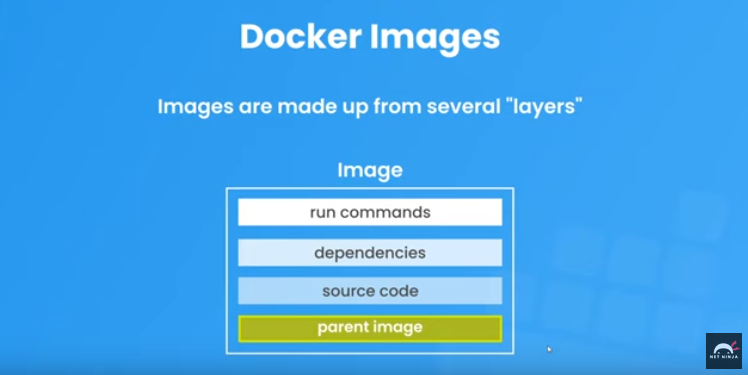
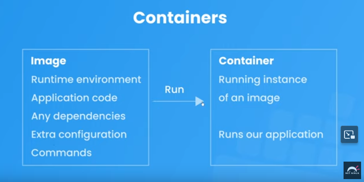
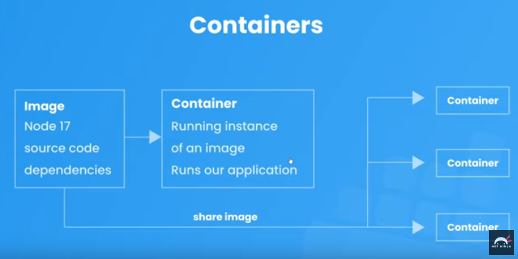

# Docker

Docker is a platform used to develop, ship, and run applications within containers. Containers allow developers to package an application and its dependencies into a standardized unit for software development. Docker provides a way to automate the deployment of applications inside lightweight containers by providing an additional layer of abstraction and automation of operating-system-level virtualization.

Here are some key components and concepts related to Docker:

1. Containerization: Docker uses containerization to encapsulate an application and its dependencies into a single unit, called a container. Each container runs in isolation from other containers and shares the underlying host operating system's kernel.

2. Docker Engine: Docker Engine is the core component of Docker that allows containers to be built, run, and managed. It consists of a server daemon called dockerd and a command-line interface (CLI) client called docker.

3. [Images](##docker-images): Docker images are read-only templates that contain everything needed to run a container, including the application code, runtime, libraries, and dependencies. Images are created using a Dockerfile, which specifies the configuration and instructions for building the image.

4. Containers: Containers are instances of Docker images that are running as isolated processes on the host operating system. Each container has its own filesystem, networking, and process space, providing a lightweight and consistent environment for running applications.

5. Dockerfile: A Dockerfile is a text file that contains instructions for building a Docker image. It specifies the base image to use, along with any additional dependencies, configuration settings, and commands needed to set up the application environment.

6. Docker Hub: Docker Hub is a cloud-based registry service provided by Docker, where users can store and share Docker images publicly or privately. It hosts a vast collection of pre-built images that can be used as base images for building custom applications.

7. Docker Compose: Docker Compose is a tool for defining and running multi-container Docker applications. It uses a YAML file to configure the services, networks, and volumes required for a multi-container application, allowing developers to define complex application architectures and dependencies with ease.

Overall, Docker simplifies the process of building, shipping, and deploying applications by providing a consistent and portable environment across different infrastructure platforms. It has become a popular tool among developers and DevOps professionals for modernizing traditional application development and deployment workflows.

## Images

Features:

1. Runtime environment

2. Apllication code

3. Dependancies and libraries

4. Extra configuration (eg:- env variables)

5. Commands

6. Read only. For any chnages image has to be recreated.

7. Indipendant file system from the rest of the computer.

### Parent Images

Images are build up of different layers where each layer add somethng image incrementally. so order of layers does matter. each layer is identified by an hash key.

Parent image is the 1st layer in our own image. Parent image contains the os and the runtime environment. This layer is allready a prebuild docker image.

next layers we build on the parent image can be any of source code, dependancies we require. Normally parent images are can be found n docker hub or any other image registers.



#### Get a parent docker image from docker hub

Every docker image have a tag/version. Its good to mention the tag or else it would allways get the latest version of the image if not mentioned.

```bash
docker pull <publishor>/<image>:<tag>
```

```bash
docker pull bitnami/wordpress:latest
```

for official images maintained by docker hub

```bash
docker pull php:7.1-apache
```

### Customization / Create our own docker image

To customize docker image we have to use a special file called `Dockerfile`


## Contaners

Containers are isolated process that runs indipendantly from the other processes in the computer. They runs instance of our application.

## Images and Containers relationship

Containers are instances of Docker images that are running as isolated processes on the host operating system.




